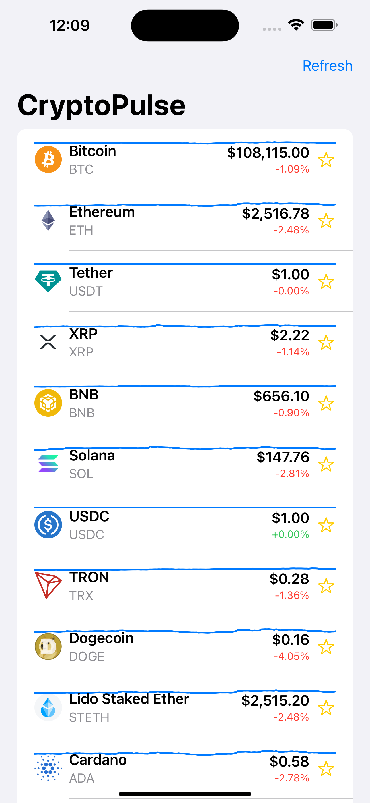

# 📈 CryptoPulse

**CryptoPulse** is a sleek real-time cryptocurrency tracker built with SwiftUI. It fetches live price and market data from the [CoinGecko API](https://www.coingecko.com/en/api) and presents it in a clean, responsive iOS interface with charts, watchlists, and offline support.

---

## 🔧 Features

- 📊 Real-time prices, sparkline charts, and market data
- ⭐️ Create your own **watchlist** with persistent local storage using SwiftData
- 📉 Interactive **Charts** integration for clean, mini price graphs
- 🔄 **Pull-to-refresh** for fetching the latest data
- ⚡️ Responsive and intuitive **SwiftUI** design
- 🔐 No API key required – powered by CoinGecko’s public API

---

## 📱 Tech Stack

- **SwiftUI** – Declarative UI framework for iOS
- **SwiftData** – For lightweight local persistence of watchlists
- **Charts** – Visualizing 7-day price trends
- **Combine** – Managing async data flow from the API
- **CoinGecko API** – Real-time cryptocurrency data

---

## 🛠 Installation

1. Clone the repository:
   ```bash
   git clone https://github.com/iNoles/CryptoPulse.git
   ```
2. Open the ```.xcodeproj``` or ```.xcodeworkspace``` in Xcode 15+
3. Build and run the project on iOS Simulator or a physical device (iOS 16+ recommended)

## 📸 Screenshots



## 🔮 Future Improvements

- Coin detail view with historical chart and volume
- Search and filter coins
- Dark mode support
- Sorting by price, market cap, etc.
